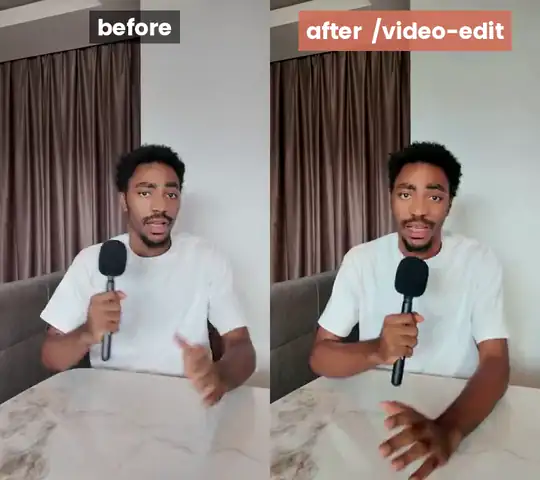
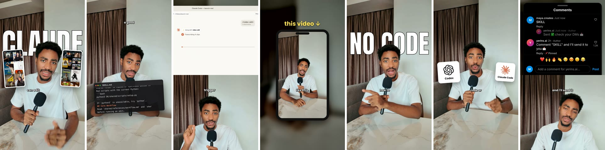

# Video Edit

[](https://github.com/yerinsabraham/video-edit-skill/actions/workflows/ci.yml)
[](LICENSE)


**Drop your raw clips, type `/video-edit`, get a finished short-form video.**

A skill for Claude Code and Codex that edits talking-head clips the way a good
editor would: it picks your best take of every line, cuts the dead air, adds
captions that move, puts the big words behind your head, pops in logos, builds
UI demos with a moving cursor, zooms, sound effects, and a colour grade, then
checks its own work. Everything runs on your computer. No API keys, no uploads.

<p align="center">
  
  <br><a href="docs/media/before-after.mp4">Watch the 15-second before/after with sound</a>
</p>



## Install

**Claude Code plugin** (updates itself):

```text
/plugin marketplace add yerinsabraham/video-edit-skill
/plugin install video-edit@video-edit-skill
```

**Or ask your agent.** Paste this into Claude Code or Codex:

```text
Install this skill for me: https://github.com/yerinsabraham/video-edit-skill
```

The agent follows [INSTALL.md](INSTALL.md): it clones the repo and runs
`python3 install.py`, which installs for every agent it finds.

**Or by hand:**

```bash
git clone https://github.com/yerinsabraham/video-edit-skill
cd video-edit-skill && python3 install.py
```

Update later with `python3 install.py --update`, or ask: *"Update the
video-edit skill from https://github.com/yerinsabraham/video-edit-skill"*.

## Use it

```text
/video-edit I just dropped 5 clips in my downloads
```

As a plugin the command is `/video-edit:video-edit`, or just ask in plain words
("edit the 5 clips I just dropped in Downloads").

The first time, it asks your name, your Instagram handle, your favourite look,
and where your clips land, checks your tools, and installs anything missing
(about two minutes, once). Then:

1. **Transcribes every take** with word-level timing (whisper.cpp, on your
   machine) and fixes what it misheard ("cloud code" becomes Claude Code).
2. **Picks your best take of every line.** Said a line three times across two
   clips? It keeps the cleanest one, in script order, and shows you a table.
3. **Cuts from your original files**, so punch-ins stay sharp on 4K footage.
4. **Applies the editing rules**: captions, the big words behind your head
   (background cut-out), logos when you name a product, an app demo when you
   describe a workflow, the file you mention floating on screen, your comment
   or follow call to action as a real-looking phone screen, zooms so something
   changes every few seconds, subtle sound effects, and a natural grade.
   Motion graphics render in parallel while the edit continues.
5. **Checks its own work**: nothing covers your face, everything sits inside
   the platform safe zones, every cut is checked, loudness is set for social.
6. **Hands you a phone-ready review copy.**

Then give notes like you would to an editor:

```text
captions a bit bigger, and cut the pause before "or you can get"
```

It changes exactly that and re-renders. Every version is saved; you can always
go back. It also asks for the real things that make an edit feel real: *"At
0-8s you say everyone is talking about this. Got two screen recordings of
those posts?"* All optional.

## Looks

Pick a default during setup; switch any section by saying so:
`/video-edit use soft when I say "the cool aesthetic", studio after that`.

| Look | Feel |
| --- | --- |
| **bold** (default) | Kinetic lowercase words, the big ones tucked behind your head, punch words in yellow, punch-ins. |
| **soft** | Warm grade, calm text, one punch line in a yellow serif italic with sparkles. Signature move: your own reels orbit around you. |
| **studio** | Dark editorial. The room falls back, you stay lit. Tiny spaced capitals, big serif words, wide and close shots alternating. |

Your reels for the orbit come from your Instagram automatically if you connect
a free [Apify](https://apify.com) account, or just drop the files in the
project folder.

## What you need

- macOS, Windows, or Linux.
- Claude Code or Codex.
- Python 3.10+, ffmpeg, and Node.js 22+ (for motion graphics).

Don't install anything by hand first: on the first run the skill checks every
tool, tells you what is missing, and installs ffmpeg (with caption support),
whisper.cpp, the speech model, and the motion-graphics engine for you.

### Platform support

| | macOS (Apple Silicon) | macOS (Intel) | Linux | Windows |
| --- | --- | --- | --- | --- |
| Edit, captions, takes, sound, grade | yes | yes | yes | yes |
| Motion graphics (HyperFrames) | yes | yes | yes | yes |
| Background cut-out, face-aware placement | Apple Vision | Apple Vision | MediaPipe | MediaPipe |
| Hardware-accelerated previews | VideoToolbox | VideoToolbox | NVENC / Quick Sync / AMF if present | NVENC / Quick Sync / AMF if present |
| One-step tool install (`setup.py --install`) | Homebrew | static builds | static builds | gyan.dev ffmpeg, whisper.cpp release, winget Node |
| Tested on every push (CI) | yes, incl. motion and cut-out | locally | yes, incl. motion and cut-out | yes, incl. motion and cut-out |

### What touches the network

Your footage, transcript, face, and voice never leave your computer. The skill
only goes online to install its tools, to download HyperFrames and a headless
Chrome on the first motion render (telemetry off), to fetch product logos from
[Simple Icons](https://simpleicons.org), and, only if you add a token, to ask
Apify for your public Instagram reels and profile stats.

## How to film your clips

- **Shoot vertical**, in 4K if your phone allows; punch-ins crop from the originals.
- **Keep the camera still** for each setup. New angle, new clip.
- **Repeat a line until it lands.** Don't stop recording; say it again. The
  skill keeps the best take.
- **Name the look in your script** if you want a section to change ("you can
  get the cool aesthetic like this"), or just tell it which look goes where.

## What it does without being asked

- Never covers your face with text or cards (it finds your face first).
- Fixes the transcript, including product names.
- Credits other creators on screen with their @handle whenever their posts appear.
- Never modifies or deletes your original clips.
- Keeps sound effects well under your voice.
- Never invents numbers or facts in a graphic.

The full rulebook is [editing-rules.md](shared/references/editing-rules.md).

## Features

| | |
| --- | --- |
| Transcription | whisper.cpp with word timings re-aligned to the real speech, so captions never jump ahead during a pause |
| Takes | Best take of every line across clips, script order rebuilt, take table, `--use L3=m2` overrides |
| Captions | Word-by-word kinetic captions, big key words, elegant serif feeling words, SRT/VTT sidecars, long-form two-line mode |
| Motion graphics | HyperFrames: app demo with cursor, comment sheet with keyboard, profile follow, code window, logo tiles, stat bars, callouts, orbiting reels, big words behind you |
| Layouts | Pop-in cards around the face, split screen, full-screen B-roll, the video shrinking into a phone |
| Camera | Face-centred punch-ins and push-ins from the original resolution |
| Sound | Synthesised SFX (no samples to license), ducked music, voice clean-up, -14 LUFS |
| Colour | Natural grade judged on your face, presets, your LUT, or match a reference still |
| Reference | `analyze_reference.py`: cuts, pacing, look, and loudness of a video you want to match |
| Long-form | Two-line captions, chapters, the production playbook for lessons and screen recordings |
| QA | Face clearance, safe zones, every cut, stream sync, full decode, caption timing |
| Handoff | Rough EDL for Premiere, Resolve, or Final Cut |

## Under the hood

The agent plans and talks to you; deterministic Python scripts do the media
work with ffmpeg, so every step leaves a file you can inspect (`takes.json`,
`recipe.json`, `qa/report.md`, ...). See [ARCHITECTURE.md](ARCHITECTURE.md) and
[workflow.md](shared/references/workflow.md) for every tool, and
[motion-graphics.md](docs/motion-graphics.md) for why HyperFrames and libass.

Run the test suite with `python3 shared/scripts/proof.py`.

## Contributing and support

Issues and pull requests are welcome; see [CONTRIBUTING.md](CONTRIBUTING.md).
Something not working? Start with
[troubleshooting.md](shared/references/troubleshooting.md). Security issues:
[SECURITY.md](SECURITY.md). What is coming next: [ROADMAP.md](ROADMAP.md).

## License

Apache-2.0. Bundled fonts (Anton, Poppins, DM Serif Display) are under the SIL
Open Font License; see [NOTICE](NOTICE). Product logos are fetched per project
and remain trademarks of their owners.
